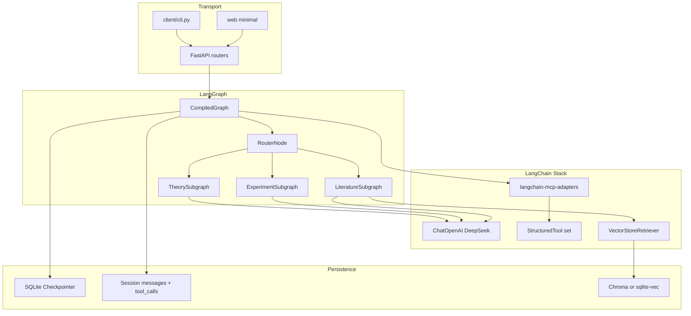
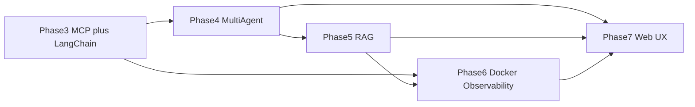

# AI4S 科研 Agent 总体迭代计划

## 现状基线（已完成）

| 模块 | 状态 | 关键路径 |
|------|------|----------|
| 对话与 SSE | 可用 | [`server/api/chat.py`](server/api/chat.py)、[`shared/schemas.py`](shared/schemas.py) |
| LLM | 自研 `DeepSeekClient` | [`server/llm/client.py`](server/llm/client.py) |
| Agent | 仅 `GeneralAgent` + 手写 tool loop | [`server/agents/base.py`](server/agents/base.py) |
| L2 会话 | SQLite + reasoning 持久化 | [`server/memory/session.py`](server/memory/session.py) |
| L1 工作记忆 | 截断 + 可选摘要 | [`server/memory/manager.py`](server/memory/manager.py) |
| MCP | 自研 `MCPClient` + 3 个 builtin server | [`server/mcp/client.py`](server/mcp/client.py)、[`mcp_servers.json`](mcp_servers.json) |
| Web | 单页 Chat + 设置侧栏 | [`web/src/components/ChatPage.tsx`](web/src/components/ChatPage.tsx) |
| 预留字段 | `a2a_task_id`、`agent_name` | [`StreamChunk`](shared/schemas.py) |

**技术债（影响 MCP 阶段必须处理）**
- 工具调用结果未写入会话历史，刷新后 `toolCalls` 丢失 → Web 与 RAG 都受影响
- 自研 MCP + 自研 tool loop 与 LangChain 全栈迁移目标冲突，应在 Phase 3 末删除而非长期双轨
- Web 流式/历史竞态已部分修复（[`web/src/hooks/useChatStream.ts`](web/src/hooks/useChatStream.ts)），但按你的优先级 Web 大改放到最后；MCP 阶段仅保留「可测」最小界面

---

## 目标架构（LangChain 全栈）



**原则**
- FastAPI 只做传输与鉴权（未来），**业务编排全部进 LangGraph**
- **单一 SSE 事件模型**：继续扩展 [`StreamChunk`](shared/schemas.py)，不另造协议
- **渐进替换**：每个 Phase 用 feature flag（如 `ORCHESTRATION_BACKEND=langgraph`）切换，通过后再删除旧路径

---

## Phase 3 — MCP 深化 + LangChain 全栈迁移（优先，约 3–4 周）

### 3.1 依赖与适配层

在 [`pyproject.toml`](pyproject.toml) 增加：
- `langchain`、`langchain-core`、`langchain-openai`（DeepSeek 兼容 OpenAI API）
- `langgraph`
- `langchain-mcp-adapters`
- `langgraph-checkpoint-sqlite`（图状态/checkpoint）

新建目录建议：
- `server/langchain/` — LLM 工厂、工具绑定、图编译入口
- `server/graph/` — State 定义、节点、边、编译器

**DeepSeek 接入**：`ChatOpenAI(base_url=..., model=...)` + `reasoning` 相关 extra_body（保留 `reasoning_effort=max` 能力，与现有 [`server/llm/client.py`](server/llm/client.py) 行为对齐）。

### 3.2 MCP 迁移到 langchain-mcp-adapters

替换 [`server/mcp/client.py`](server/mcp/client.py) 核心连接逻辑：
- 从 [`mcp_servers.json`](mcp_servers.json) 生成 `MultiServerMCPClient` 配置（stdio 子进程）
- 工具名继续规范为 `{server}__{tool}`，避免与现有测试/文档断裂
- 生命周期：在 [`server/main.py`](server/main.py) lifespan 中 connect/disconnect（与现有一致）

**MCP 能力补齐（本 Phase 交付）**

| 能力 | 说明 |
|------|------|
| 工具结果截断 | 写入 context 前按 token/字符上限裁剪 + 摘要提示 |
| 按 Agent 工具白名单 | Literature 仅 arxiv/web_search；Experiment 仅 filesystem 等 |
| 轮次与并行控制 | `MCP_MAX_TOOL_ROUNDS` + 单轮 max parallel tool calls |
| 连接状态 API | 扩展 [`GET /v1/mcp/status`](server/api/mcp.py)：失败原因、工具数、延迟 |
| 配置热重载（可选） | `POST /v1/mcp/reload` 重读 json（需重启子进程） |
| 会话内 tool_calls 持久化 | 扩展 SQLite schema：assistant 消息关联 tool_calls JSON |

### 3.3 Tool Loop 迁入 LangGraph

用 **ReAct 子图** 替代 [`GeneralAgent._run_tool_loop`](server/agents/base.py)：
- 节点：`call_model` → `tools` → `call_model` … → `finalize`
- 流式：LangGraph `astream_events` 映射为现有 SSE：`tool_call_start/result/error`、`reasoning`、`content`、`done`
- **GeneralAgent 保留为薄包装**，内部只调 `graph.astream`

### 3.4 测试与文档

- 扩展 [`tests/test_mcp.py`](tests/test_mcp.py)、[`tests/test_api.py`](tests/test_api.py)
- 更新 [`docs/mcp-config.md`](docs/mcp-config.md)（LangChain 路径、reload、工具白名单）
- Web：仅保证 MCP 测试路径可用（工具面板 + 最终回复），不大改 UI

**Phase 3 完成标准**
- `ORCHESTRATION_BACKEND=langgraph` 下 CLI/Web 可完成：filesystem 读写、arxiv 检索、web_search
- 旧 `DeepSeekClient` + 自研 tool loop 可开关关闭且测试全绿
- 刷新页面后仍能看到历史中的工具调用记录（持久化）

---

## Phase 4 — 多 Agent 实现（约 3–4 周）

### 4.1 Agent 拆分

按 README 规划在 `server/agents/`（或 `server/graph/agents/`）实现：

| Agent | 职责 | 工具子集 | Prompt 来源 |
|-------|------|----------|-------------|
| `general` | 通用问答 | 全部或默认子集 | 现有 DEFAULT |
| `theory` | 损失函数/优化理论推导 | 无或仅文献 | `MATH_MODE` 扩展 |
| `experiment` | 实验日志、指标分析 | filesystem + 未来实验 MCP | 新建 |
| `literature` | 文献检索与综述 | arxiv + web_search | 新建 |

每个 Agent = **独立 LangGraph 子图**（共享 LLM 工厂与 checkpointer）。

### 4.2 路由与编排

**Supervisor 图**（LangGraph 推荐模式）：
1. `classify_intent` — 规则 + LLM 分类（math/theory/experiment/literature/general）
2. `route` — 条件边到子图
3. `synthesize` — 可选：多 Agent 结果合并（后续复杂任务）

扩展 SSE：
- `type: meta` 增加 `agent_name`、可选 `route_reason`
- 新增 `type: agent_handoff`（from/to agent，供未来 Web 时间线使用）
- 填充 `a2a_task_id`（子任务 ID，便于追踪）

### 4.3 API 与 CLI

- `ChatRequest` 增加可选 `agent` 或 `auto_route=true`（默认自动路由）
- CLI：`--agent theory` / `--auto-route`
- 保持 `mode=math` 作为 theory 快捷方式

**Phase 4 完成标准**
- 同一 session 内可自动路由到不同 Agent，SSE 带正确 `agent_name`
- 各 Agent 仅暴露白名单工具，误调用率显著下降
- 集成测试：3 条典型 prompt 分别命中 theory / experiment / literature

---

## Phase 5 — 科研记忆 / RAG（约 3–4 周）

### 5.1 L3 向量记忆

在现有 L1（截断）、L2（SQLite 会话）之上增加 L3：

| 组件 | 建议选型 | 说明 |
|------|----------|------|
| 向量库 | Chroma（本地）或 sqlite-vec | 与单机 Docker 部署友好 |
| Embedding | DeepSeek embedding 或开源 fallback | 配置化 |
| 文档源 | `data/mcp_files`、导入 PDF/Markdown、arxiv 缓存 | ingestion pipeline |

新建 `server/memory/rag/`：分块、索引、检索、重排序（可选）。

### 5.2 与多 Agent 集成

- `literature` 子图：检索节点 → LLM 综述
- `theory`：检索自有笔记/论文片段
- `experiment`：检索实验日志与指标说明

API：
- `POST /v1/documents` 上传/索引
- `GET /v1/documents` 列表
- `DELETE /v1/documents/{id}`

会话策略：RAG 结果写入图 state，**不全量塞进 L2 消息表**（仅存引用 doc_id + snippet）。

**Phase 5 完成标准**
- 上传一篇 markdown 后，literature Agent 回答能引用检索片段
- RAG 与 MCP arxiv 可组合：先 MCP 拉元数据，再入库索引

---

## Phase 6 — Docker 镜像与可观测（约 2 周）

### 6.1 Docker 交付物

```
docker/
  Dockerfile          # multi-stage: npm build web + python app
  docker-compose.yml  # app + 可选 chroma
  .env.example
```

- 单容器：uvicorn + 静态 `web/dist`
- 数据卷：`data/`（sessions.db、mcp_files、vector store）
- 健康检查：`/health`
- MCP 子进程：容器内安装 python + 所需 npx 依赖说明

### 6.2 可观测与成本

- 结构化日志（request_id、session_id、agent_name、tool_name、latency）
- Token usage 聚合：按 session / agent / day 统计（SQLite 表或 Prometheus 可选）
- 错误告警：MCP 连接失败、工具超时、LLM 5xx

**Phase 6 完成标准**
- `docker compose up` 一键启动，浏览器可对话 + MCP
- 日志中能追踪一次完整 tool call 链路

---

## Phase 7 — Web 前端设计与体验优化（最后，约 3–4 周）

在后端稳定后再做 UI 投资，避免重复返工。

### 7.1 信息架构

- **左侧**：会话列表 + 新建会话
- **中间**：消息流（用户 / Agent 标签 / 工具时间线 / reasoning 折叠）
- **右侧**：Agent 设置（模式、L1、MCP、RAG 文档管理）
- **顶栏**：连接状态、当前 Agent、token 用量

### 7.2 关键体验

- 工具调用 **时间线组件**（对齐 SSE `tool_call_*` + `agent_handoff`）
- 流式稳定性：单一消息状态机，禁止 history 覆盖 in-flight（延续 [`useChatStream`](web/src/hooks/useChatStream.ts) 方向）
- RAG：文档上传与管理页
- 响应式 + 暗色模式（可选）
- [`ErrorBoundary`](web/src/components/ErrorBoundary.tsx) 全覆盖

### 7.3 工程

- 组件库收敛（可选 shadcn/ui）
- E2E：Playwright 覆盖 MCP 流式一条 happy path
- 生产构建仍由 Docker 阶段集成

**Phase 7 完成标准**
- 无需手动刷新即可完整看到 MCP + 多 Agent 路由过程
- 与 Docker 镜像默认 UI 一致

---

## 依赖关系总览



---

## 风险与缓解

| 风险 | 缓解 |
|------|------|
| DeepSeek reasoning 在 LangChain 中行为不一致 | Phase 3 先做 parity 测试对比旧客户端 |
| MCP stdio 在 Docker 内权限/路径问题 | Phase 6 专门做容器化 MCP 集成测试 |
| 全栈迁移周期长 | Feature flag + 每 Phase 删除旧代码，避免双轨腐烂 |
| 工具过多导致 LLM 选错工具 | Phase 3 白名单 + Phase 4 按 Agent 缩小工具集 |
| RAG 质量不稳定 | 先窄场景（本地 markdown + arxiv 元数据），再扩 PDF |

---

## 建议的近期 Sprint（Phase 3 第 1 周）

1. 引入 LangChain 依赖 + `ChatOpenAI(DeepSeek)` 工厂，parity 测试 reasoning/content
2. `langchain-mcp-adapters` 连接现有 3 个 server，CLI 走新路径
3. SQLite 增加 `tool_calls` 字段并写入
4. 最小 LangGraph tool-loop 子图 + SSE 映射
5. 文档更新 [`README.md`](README.md) Phase 3 章节
