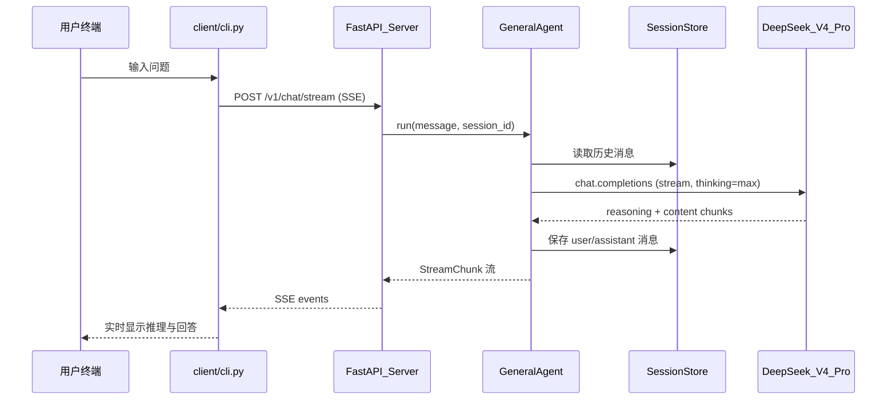

# AI4S 科研辅助 Agent — Phase 1

面向「深度学习损失函数极小值理论」研究的 AI4S 智能体辅助工具。

**Phase 1 能力**：基于 DeepSeek V4 Pro（`reasoning_effort=max`，1M 上下文）的可对话 Agent Server + 终端 CLI Client。

**后续规划**：理论推导 / 实验分析 / 文献检索 / 科研记忆（RAG）多智能体协同。

---

## 架构总览



### 目录说明

| 路径 | 职责 | C++ 类比 |
|------|------|----------|
| `server/main.py` | HTTP 服务入口、CORS、生命周期 | `main()` + 注册路由 |
| `server/config.py` | 从 `.env` 加载配置 | Config 单例 |
| `server/api/chat.py` | REST/SSE 端点 | Route handlers |
| `server/llm/client.py` | DeepSeek API 封装 | HTTP Client 层 |
| `server/llm/prompts.py` | System prompt 定义 | 常量/模板 |
| `server/agents/base.py` | Agent 抽象 + GeneralAgent | 虚基类 + 实现 |
| `server/memory/session.py` | 内存会话存储 | `unordered_map<string, vector<Message>>` |
| `client/cli.py` | 终端交互客户端 | CLI 程序 |
| `shared/schemas.py` | 请求/响应数据结构 | `common/` 下的 struct 定义 |

---

## 环境准备

**要求**：Python 3.11+

```bash
# 1. 进入项目目录
cd /path/to/agent

# 2. 创建虚拟环境（推荐）
python3 -m venv .venv
source .venv/bin/activate   # Linux/macOS
# .venv\Scripts\activate    # Windows

# 3. 安装项目（可编辑模式，改代码即时生效）
pip install -e .

# 4. 配置环境变量
cp .env.example .env
# 编辑 .env，填入 DEEPSEEK_API_KEY
```

### 获取 DeepSeek API Key

1. 访问 [DeepSeek 开放平台](https://platform.deepseek.com/)
2. 注册/登录 → **API Keys** → 创建密钥
3. 将密钥写入 `.env` 的 `DEEPSEEK_API_KEY=sk-...`

---

## 配置说明（.env）

| 变量 | 默认值 | 说明 |
|------|--------|------|
| `DEEPSEEK_API_KEY` | （必填） | API 密钥 |
| `DEEPSEEK_BASE_URL` | `https://api.deepseek.com` | API 地址 |
| `MODEL` | `deepseek-v4-pro` | 模型 ID |
| `MAX_TOKENS` | `384000` | 最大输出 token（thinking max 需大预算） |
| `REASONING_EFFORT` | `max` | 推理强度：`high` 或 `max` |
| `LOG_LEVEL` | `INFO` | `DEBUG` 可打印 LLM 请求摘要 |
| `HOST` / `PORT` | `0.0.0.0` / `8000` | 服务监听地址 |

---

## 快速启动

需要 **两个终端**：

**终端 1 — 启动 Server：**

```bash
source .venv/bin/activate
uvicorn server.main:app --reload --host 0.0.0.0 --port 8000
```

启动成功后会打印配置摘要（API Key 脱敏）：

```
AI4S Research Agent Server 启动
  模型: deepseek-v4-pro
  推理强度: max
  API Key: sk-***xxxx
```

**终端 2 — 启动 CLI：**

```bash
source .venv/bin/activate
python -m client.cli
# 或
research-agent-cli
```

---

## API 参考

### GET /health

健康检查，不调用 DeepSeek。

```bash
curl http://127.0.0.1:8000/health
```

响应示例：

```json
{"status":"ok","model":"deepseek-v4-pro","reasoning_effort":"max"}
```

### POST /v1/chat（非流式）

```bash
curl -X POST http://127.0.0.1:8000/v1/chat \
  -H "Content-Type: application/json" \
  -d '{"message": "什么是损失函数的极小值？", "session_id": "test-001"}'
```

响应示例：

```json
{
  "session_id": "test-001",
  "content": "...",
  "reasoning": "...",
  "usage": {"prompt_tokens": 100, "completion_tokens": 200, "total_tokens": 300}
}
```

### POST /v1/chat/stream（SSE 流式）

CLI 默认使用此端点。curl 测试：

```bash
curl -N -X POST http://127.0.0.1:8000/v1/chat/stream \
  -H "Content-Type: application/json" \
  -d '{"message": "简要解释 SGD 收敛性", "session_id": "test-002"}'
```

SSE 事件 `type` 含义：

| type | 说明 |
|------|------|
| `meta` | 含 `session_id` |
| `reasoning` | thinking 推理片段 |
| `content` | 回答片段 |
| `done` | 结束，含 `usage` |
| `error` | 错误信息 |

### GET /v1/sessions/{session_id}

查询会话历史。

### DELETE /v1/sessions/{session_id}

清空会话消息（保留 session_id）。

---

## CLI 命令

```bash
python -m client.cli --help

# 常用参数
python -m client.cli --server http://127.0.0.1:8000
python -m client.cli --session my-theory-work    # 固定会话 ID
python -m client.cli --no-show-reasoning         # 隐藏推理过程
```

**交互内置命令：**

| 命令 | 说明 |
|------|------|
| `/clear` | 清空当前会话历史 |
| `/history` | 查看会话历史 |
| `exit` / `quit` | 退出 |
| 行末 `\` + 回车 | 多行输入，空行发送 |

---

## 调试指南

| 现象 | 可能原因 | 排查步骤 |
|------|----------|----------|
| 启动报 `ValidationError: DEEPSEEK_API_KEY` | `.env` 未配置或仍为占位符 | 复制 `.env.example` → `.env` 并填入真实 key |
| `401 Unauthorized` | API Key 无效或余额不足 | 检查 DeepSeek 控制台 |
| CLI `Connection refused` | Server 未启动 | 先运行 uvicorn |
| SSE 无输出后中断 | 网络/API 限流 | 设 `LOG_LEVEL=DEBUG` 看 server 日志 |
| 多轮对话无上下文 | session_id 不一致 | CLI 用 `--session` 固定 ID |
| 重启后会话丢失 | Phase 1 内存存储 | 正常行为，Phase 2 将持久化 |
| reasoning 为空 | 模型/参数问题 | 确认 `REASONING_EFFORT=max` |

**开启 DEBUG 日志：**

```bash
LOG_LEVEL=DEBUG uvicorn server.main:app --reload
```

---

## Python / C++ 速查表

| Python（本项目） | C++ 近似 |
|------------------|----------|
| `async def` / `await` | 协程 + `co_await` |
| `AsyncOpenAI` | 带连接池的 HTTP Client |
| `FastAPI` + `@router.post` | HTTP 路由 handler |
| `pydantic.BaseModel` | 带校验的结构体 + JSON |
| `async for chunk in stream` | 异步 range-for / generator |
| `dict[str, list]` | `unordered_map<string, vector<T>>` |
| `yield` in async generator | 惰性流式产出 |
| `.env` + `Settings` | 配置文件 + 全局 Config |
| SSE | 单向长连接推送 |
| `uvicorn` | standalone HTTP server |

---

## Phase 2 扩展指引：新增 Agent

1. 在 `server/agents/` 新建文件，继承 `BaseAgent`
2. 定义专用 `system_prompt`（可参考 `server/llm/prompts.py`）
3. 实现 `async def run(...)` 方法
4. 在 `server/api/` 添加 router 或 intent 路由，按用户意图分发

示例骨架：

```python
class TheoryAgent(BaseAgent):
    name = "theory"
    system_prompt = "..."

    async def run(self, message, session_id, *, system_prompt_override=None):
        # 与 GeneralAgent 类似，可接入专用工具（如符号计算）
        ...
```

---

## 依赖

见 `pyproject.toml`。核心：`fastapi`, `uvicorn`, `openai`, `pydantic-settings`, `httpx`, `httpx-sse`, `rich`, `prompt-toolkit`。

---

## 许可证

MIT（科研辅助工具，请遵守 DeepSeek API 使用条款）。
