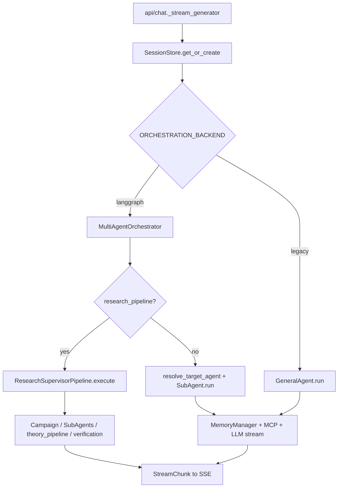
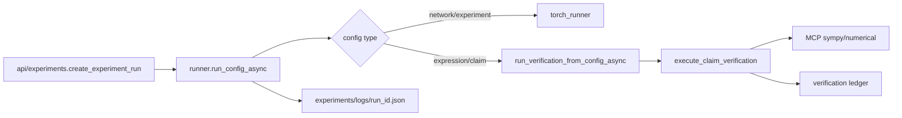

# API 全路径与调用链路（v2.2）

Base URL 默认：`http://127.0.0.1:8000`。  
**覆盖矩阵（67）**：[`API-COVERAGE.md`](API-COVERAGE.md) · **速查**：[`API.md`](API.md) · **OpenAPI**：`GET /docs` · **Schema**：`app/shared/schemas.py`。

> 路径参数在覆盖表里常写作 `{id}`；代码中实际名为 `{session_id}` / `{project_id}` / `{campaign_id}` 等，以下以**代码路径**为准。

## 约定

| 项 | 说明 |
|----|------|
| 鉴权 | 当前无 Bearer / API Key（见 KNOWN_ISSUES C2） |
| CORS | `allow_origins=["*"]`（`server/main.py`） |
| 请求追踪 | `RequestContextMiddleware` → 响应头 `X-Request-ID` |
| 挂载 | 15 个 `APIRouter` **无前缀**挂到 FastAPI（路径写在装饰器上） |
| SSE | 仅 `POST /v1/chat/stream`：`text/event-stream`，帧格式 `data: {json}\n\n` |
| 错误 | 422 校验 · 403 功能关闭/越界 · 404 缺失 · 502 LLM/上游 |

```mermaid
flowchart TB
  http[HTTP_Client] --> api[server/api]
  api --> agents[agents/orchestrator_subagent]
  api --> graph[graph/pipeline_supervisor]
  api --> mem[memory_session_structured]
  api --> exp[experiments_verification]
  api --> mcp[mcp/client]
  api --> exportMod[export/builder]
```

---

## 1. Health / Chat / Sessions

**模块**：[`app/server/api/chat.py`](../app/server/api/chat.py) · tag `chat`

| 方法 | 路径 | Schema / 说明 |
|------|------|----------------|
| GET | `/health` | `HealthResponse`：不调 LLM |
| POST | `/v1/chat` | `ChatRequest` → `ChatResponse` |
| POST | `/v1/chat/stream` | `ChatRequest` → SSE |
| GET | `/v1/sessions` | `SessionListResponse` |
| GET | `/v1/sessions/{session_id}` | `SessionResponse` |
| DELETE | `/v1/sessions/{session_id}` | `purge` 查询参数：清空或删库 |

### `POST /v1/chat/stream` 全路径



编号链路：

1. [`api/chat.py`](../app/server/api/chat.py) `chat_stream` → `StreamingResponse(_stream_generator)`
2. [`memory/session.py`](../app/server/memory/session.py) `get_session_store().get_or_create`
3. 若 `orchestration_backend == langgraph`：[`agents/orchestrator.py`](../app/server/agents/orchestrator.py) `MultiAgentOrchestrator`
   - 可选 [`graph/research_pipeline.py`](../app/server/graph/research_pipeline.py) → [`graph/research_supervisor.py`](../app/server/graph/research_supervisor.py)
   - 否则 `resolve_target_agent` → [`agents/subagent.py`](../app/server/agents/subagent.py) `SubAgent.run`
4. 否则 [`agents/base.py`](../app/server/agents/base.py) `GeneralAgent.run`
5. 共性：MemoryManager（L1/L2）+ 可选 RAG/结构化注入 + MCP ReAct + LLM；Theory 后处理可走 [`graph/theory_pipeline.py`](../app/server/graph/theory_pipeline.py)
6. 每个 `StreamChunk` → SSE `data:` 行

**副作用**：写会话消息（含 reasoning / tool_calls / workflow_steps）；Campaign 更新；验证账本（Theory 闭环）；Token 统计。

**SSE 常见 type**：`meta` → `pipeline_stage` / `campaign_update` / `workflow_step` / `tool_call_*` / `reasoning` / `cot_step` / `content` / `verification_result` / `numerical_verification_result` / `memory_warning` / `done` | `error`。

```bash
curl -N -X POST http://127.0.0.1:8000/v1/chat/stream \
  -H "Content-Type: application/json" \
  -d '{"message":"二次损失临界点","session_id":"demo","mode":"math","agent":"theory"}'
```

### Sessions 全路径

1. `api/chat.py` list/get/delete
2. `memory/session.get_session_store()` → InMemory 或 SQLite（`SESSION_STORE_BACKEND`）
3. `DELETE` + `purge=true`：删会话；可级联清 RAG 引用与会话文档（见实现）

**测试**：`tests/api/` 中 chat/sessions 相关；`tests/api/test_smoke_all.py`。

---

## 2. Agents / MCP

| 方法 | 路径 | 模块 | 链路摘要 |
|------|------|------|----------|
| GET | `/v1/agents` | `api/agents.py` | 读 Agent 注册表 / 配置 → JSON 列表 |
| GET | `/v1/mcp/status` | `api/mcp.py` | `mcp.client.build_mcp_status` |
| POST | `/v1/mcp/reload` | `api/mcp.py` | `reload_mcp_client` 热重连 stdio Server |

**副作用**：reload 断开并重建全局 MCP 单例。

---

## 3. Documents / RAG

**模块**：[`api/documents.py`](../app/server/api/documents.py) · tag `documents`

| 方法 | 路径 | 说明 |
|------|------|------|
| POST | `/v1/documents` | 文本入库 |
| POST | `/v1/documents/upload` | PDF/DOCX/MD 上传 |
| POST | `/v1/documents/from-arxiv` | arXiv 拉取入库 |
| GET | `/v1/documents` | 列表（可按 session） |
| DELETE | `/v1/documents` | 全局 purge |
| DELETE | `/v1/documents/session/{session_id}` | 清空会话文档 |
| DELETE | `/v1/documents/{doc_id}` | 删单条 |
| GET | `/v1/sessions/{session_id}/rag-refs` | RAG 引用列表 |

**链路**：`api/documents` → `memory/rag/*`（ingest/embeddings/chroma）→ 文件系统/向量库；依赖 `ENABLE_RAG`。

---

## 4. Stats

| 方法 | 路径 | 链路 |
|------|------|------|
| GET | `/v1/stats/tokens` | `api/stats.py` → Token 用量存储（按 session 等） |

---

## 5. Structured Memory（L4）

**模块**：[`api/structured_memory.py`](../app/server/api/structured_memory.py) · tag `memory`

| 方法 | 路径 | 说明 |
|------|------|------|
| GET | `/v1/memory/structured` | 会话定理库 |
| GET | `/v1/memory/structured/global` | 全局 |
| GET | `/v1/memory/structured/graph` | 图谱 |
| POST | `/v1/memory/structured` | 写入条目 |
| GET/POST | `/v1/memory/structured/{entry_id}/versions` | 版本 |
| POST | `/v1/memory/structured/{entry_id}/edges` | 依赖边 |

**链路**：`api` → `memory/structured/store.py`（SQLite）± 证明状态 / 闸门辅助模块。

---

## 6. Theory / Bibliography

**模块**：[`api/theory.py`](../app/server/api/theory.py) · tag `theory`

| 方法 | 路径 | 说明 |
|------|------|------|
| GET | `/v1/theory/workspace` | 工作区文件列表 |
| GET/PUT | `/v1/theory/workspace/{file_path:path}` | 读写 md |
| GET | `/v1/theory/symbols` | 符号表种子 |
| GET | `/v1/theory/assumptions` | 假设列表 |
| GET | `/v1/theory/assumption-matrix` | 假设矩阵 |
| GET | `/v1/theory/assumption-dag` | DAG |
| GET | `/v1/theory/assumption-dag/impact/{assumption_id}` | 影响传播 |
| GET | `/v1/bibliography` | 书目 JSON |
| GET | `/v1/bibliography/export.bib` | BibTeX |

**链路**：读 `THEORY_WORKSPACE_PATH` / `data/theory` 种子；书目按 `project_id` 过滤。静态路径须注册在 `{file_path:path}` 之前（当前代码顺序正确）。

---

## 7. Experiments

**模块**：[`api/experiments.py`](../app/server/api/experiments.py) · tag `experiments`

| 方法 | 路径 | Schema |
|------|------|---------|
| POST | `/v1/experiments/runs` | `ExperimentRunRequest` → 运行结果 dict |
| GET | `/v1/experiments/runs` | `ExperimentRunsResponse` |
| GET | `/v1/experiments/runs/{run_id}` | 单条 JSON 日志 |

### `POST /v1/experiments/runs` 全路径



1. [`api/experiments.py`](../app/server/api/experiments.py) **`await run_config_async`**（禁止嵌套 event loop）
2. [`experiments/runner.py`](../app/server/experiments/runner.py) 加载 `data/experiments/configs/{name}.yaml`
3. Torch 分支 / [`verification_executor.py`](../app/server/experiments/verification_executor.py) → [`mcp/client.py`](../app/server/mcp/client.py)
4. 写 `settings.experiments_path/logs/{run_id}.json`

```bash
curl -s -X POST http://127.0.0.1:8000/v1/experiments/runs \
  -H "Content-Type: application/json" \
  -d '{"config_path":"quadratic_minimum.yaml"}'
```

**测试**：`tests/api/test_smoke_all.py` · `tests/test_verification_executor_async.py`。

---

## 8. Export

**模块**：[`api/export.py`](../app/server/api/export.py) · tag `export`

| 方法 | 路径 | 作用域说明 |
|------|------|------------|
| GET | `/v1/export/preview` | 查询参数：`session_id` / `include_global` / `include_chat`（**无** `project_id`） |
| POST | `/v1/export/polish` | `LatexExportRequest`；需 `ai_instructions` |
| POST | `/v1/export/md` | Markdown 下载 |
| POST | `/v1/export/docx` | Word |
| POST | `/v1/export/pdf` | PDF |
| POST | `/v1/export/latex` | LaTeX；`project_id` 用于 **书目/Bib** 装配 |

### 导出全路径

1. `api/export` → [`export/builder.py`](../app/server/export/builder.py) `collect_export_entries` / `describe_export_sources`（按 **session + global**，不按课题过滤正文）
2. `build_markdown_document`；可选 [`export/ai_polish.py`](../app/server/export/ai_polish.py)
3. `md`/`docx`/`pdf`：[`docx_exporter.py`](../app/server/export/docx_exporter.py) / [`pdf_exporter.py`](../app/server/export/pdf_exporter.py)
4. `latex`：`build_latex_document(..., project_id=)` 注入课题书目

**注意**：前端 `ExportPanel` 可能在 body 里带 `project_id`，但对 preview/md/docx/pdf **正文收集无效**；仅 latex/bib 路径消费。按课题过滤正文属后续增强，当前以本说明为准。

---

## 9. Projects / Campaigns

**模块**：[`api/projects.py`](../app/server/api/projects.py) · [`api/campaigns.py`](../app/server/api/campaigns.py)

| 方法 | 路径 | 说明 |
|------|------|------|
| GET/POST | `/v1/projects` | 列表 / 创建 |
| GET | `/v1/projects/{project_id}` | 详情 |
| GET | `/v1/projects/{project_id}/members` | 成员 |
| GET/POST | `/v1/projects/{project_id}/tasks` | 任务看板 |
| PATCH | `/v1/projects/{project_id}/tasks/{task_id}` | 更新任务 |
| GET | `/v1/projects/{project_id}/sessions` | 课题会话 |
| POST | `/v1/projects/{project_id}/sessions/{session_id}` | 关联会话 |
| GET | `/v1/projects/{project_id}/campaign` | 当前活跃 Campaign |
| GET/POST | `/v1/projects/{project_id}/campaigns` · `.../campaign` | 列表 / 创建 |
| GET/PATCH | `/v1/projects/{project_id}/campaigns/{campaign_id}` | 详情 / 更新阶段 |

**链路**：`memory/projects.py` · `memory/campaigns.py`（JSON/SQLite 持久化）。Campaign 阶段推进也可由对话 Supervisor SSE 驱动。

---

## 10. Verification

**模块**：[`api/verification.py`](../app/server/api/verification.py) · tag `verification`

| 方法 | 路径 | 说明 |
|------|------|------|
| GET | `/v1/verification/records` | 账本列表 |
| GET | `/v1/verification/dashboard` | 汇总 + `env_hints`（如缺 PyTorch） |
| POST | `/v1/verification/run` | 手动跑 Claim |

### `POST /v1/verification/run` 全路径

1. `api/verification.run_verification`
2. [`experiments/verification_executor.execute_claim_verification`](../app/server/experiments/verification_executor.py)（**async，主循环 await**）
3. `get_mcp_client()` → SymPy（若 `tier_hint` 允许）+ `numerical__critical_point_classify`
4. [`memory/verification`](../app/server/memory/verification.py) ledger 追加
5. 返回 `{ claim, tiers, overall_passed, ... }`；成功时 numerical 常为 `pass`，顶层实验日志风格为 `completed`

```bash
curl -s -X POST http://127.0.0.1:8000/v1/verification/run \
  -H "Content-Type: application/json" \
  -d '{"claim":{"expression":"x0**2 + x1**2","point":"0,0","variables":"x0,x1","expected":{"classification":"local_minimum"},"tier_hint":"numerical"},"session_id":"demo-v"}'
```

**测试**：`tests/api/test_smoke_all.py` · derivation_benchmark。

---

## 11. Observability / Sync / Jupyter

| 域 | 方法 | 路径 | 链路 |
|----|------|------|------|
| Observability | GET | `/v1/observability/summary` | `api/observability` → 聚合统计 |
| Observability | GET | `/v1/observability/agent-quality` | Agent 质量指标 |
| Sync | POST | `/v1/sync/metadata` | `ENABLE_CLOUD_SYNC` 否则 **403** |
| Sync | GET | `/v1/sync/audit/{project_id}` | 审计日志 |
| Jupyter | GET | `/v1/jupyter/template` | 返回 ipynb 模板 |
| Jupyter | POST | `/v1/jupyter/upload-result` | 结果回传落盘 |

---

## 12. Router 挂载顺序（main.py）

1. chat · 2. agents · 3. mcp · 4. documents · 5. stats · 6. structured_memory · 7. theory · 8. experiments · 9. export · 10. projects · 11. campaigns · 12. verification · 13. observability · 14. sync · 15. jupyter  

另：存在 `app/web/dist` 时托管静态 `/` 与 `/assets`（不计入 67）。

---

## 测试入口（对照）

| 套件 | 用途 |
|------|------|
| `pytest tests/api/` | 分域 API |
| `pytest tests/api/test_smoke_all.py` | 全量冒烟 |
| `pytest tests/e2e/` | 黄金路径 |
| `cd app/web && npx playwright test` | 浏览器 E2E |

---

## 修订记录（文档对齐）

- 路径参数命名以代码为准；覆盖表 `{id}` 为简写。
- 导出：`project_id` **不**用于 preview/md/docx/pdf 正文过滤；用于 latex/bib。
- ChatRequest agent 含 `review` / `counterexample`。
- 实验运行须 `await run_config_async`，避免嵌套 event loop 卡死。
