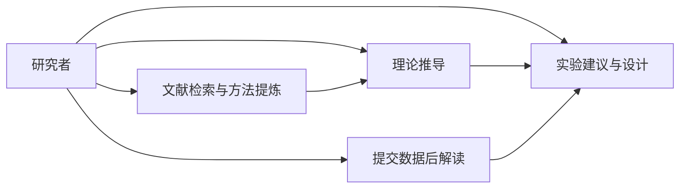
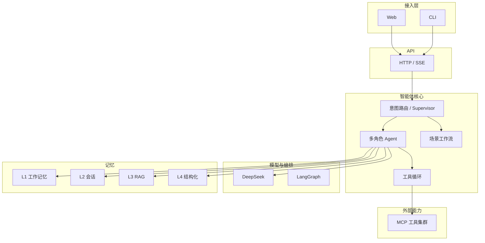
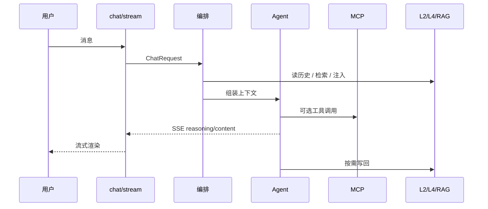
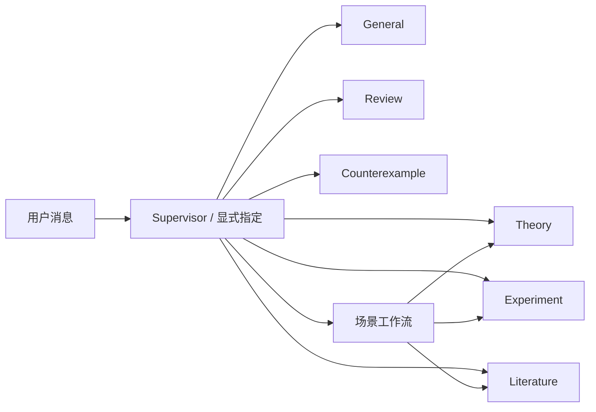

# 架构说明（v2.2）

端点清单见 [`API-COVERAGE.md`](API-COVERAGE.md)。产品定位与边界见 [`PRODUCT-VISION.md`](PRODUCT-VISION.md)。

本文合并原「架构说明」与「系统架构图」：上半为能力与全景图，下半为实现层要点。

## 产品能力边界

本系统是 **AI4S 理论侧多智能体**（用深度学习做科学问题的理论侧协作）：文献方法提炼、理论推导、实验建议与用户数据解读。损失函数局部极小 / 优化理论等为**示范子集**。

| 主路径 | 降调 / 非主卖点 |
|--------|-----------------|
| theory / literature / experiment（顾问）/ review | Torch 代跑训练、以 numerical 实跑为核心卖点 |
| 场景工作流 auto：lit→theory / 实验计划 / 数据→下一步 | 「完整科研工作流复现」叙事 |
| Artifact Store + `/v1/artifacts` | 旧 Campaign S0–S8（**已从代码移除**） |
| 用户提交实验日志 / Jupyter → DataPacket | 云端训模型 / 代部署推理 |



## 系统总览



## 分层结构（实现）

```
┌─────────────────────────────────────────┐
│  传输层：CLI / Web（SSE 客户端）          │
├─────────────────────────────────────────┤
│  API：server/api/*.py（15 域 · 65 端点） │
├─────────────────────────────────────────┤
│  Agent：理论侧多角色 + LangGraph 路由     │
│         （场景工作流 2–3 跳 / 单 Agent）  │
├──────────────┬──────────────────────────┤
│  记忆 L1–L4 / 课题 / RAG                 │  LLM + MCP │
├──────────────┴──────────────────────────┤
│  导出 / Artifact / 可选验证与 Jupyter / 可观测 │
└─────────────────────────────────────────┘
```

## 一次流式对话链路

1. Web/CLI → `POST /v1/chat/stream`（可带 `project_id`）
2. `chat.py` 校验 `ChatRequest`，选择 `legacy` 或 `langgraph` 编排
3. Agent 读 L2 历史，经 L1 截断/摘要后拼消息
4. MCP 启用时：工具循环 → stdio Server（按 Agent 白名单）
5. RAG 启用且 Agent 在 `RAG_AGENTS`：Chroma 检索注入
6. theory / review：注入理论种子（symbols/assumptions）+ L4；SymPy 可作符号辅助
7. `RESEARCH_PIPELINE_MODE=auto` 时匹配场景 → `graph/scenes/` 短协作
8. 流式 `StreamChunk` → SSE；Artifact 按需落盘
9. L4 / 课题产物按需写入



## 多 Agent 与场景



| Agent | 职责（理论侧） |
|-------|----------------|
| general | 总览问答；建议实验但不代跑训练 |
| theory | 数学推导；文献方法→形式化；SymPy 符号辅助 |
| experiment | **实验顾问**：计划、对照、读用户数据、下一步/缺数 |
| literature | 检索与方法提炼（假设/损失/公式骨架） |
| review | 审稿清单检查 |
| counterexample | 反例构造思路与最小维建议 |

| 模式 | 入口 | 说明 |
|------|------|------|
| `single` | 默认 | 单 Agent |
| `auto` | `RESEARCH_PIPELINE_MODE=auto` | **场景工作流**（2–3 跳），见 `graph/scenes/` |

| `ORCHESTRATION_BACKEND` | 行为 |
|-------------------------|------|
| `legacy` | `GeneralAgent` + 自研 tool loop |
| `langgraph` / `multi` | Supervisor + SubAgent + 可选场景工作流 |

## 记忆与课题

| 层级 / 模块 | 实现 | 说明 |
|-------------|------|------|
| L1 工作记忆 | `memory/working.py` | 截断、可选摘要 |
| L2 会话 | `memory/session.py` | SQLite / 内存 |
| L3 RAG | `memory/rag/` | Chroma，按 session 隔离 |
| L4 结构化 | `memory/structured/` | 定理/引理/边/版本 |
| 课题 | `memory/projects.py` + `api/projects.py` | Project、任务看板、会话关联 |
| Artifact | `artifacts/` + `api/artifacts.py` | DerivationTrace / ExperimentPlan 等 |
| 验证账本（可选） | `api/verification.py` + experiments | Claim 验证记录；非主卖点 |
| 书目（内部） | `memory/bibliography.py` | 仅 LaTeX 导出注入；无 HTTP |

> Theory **HTTP**（workspace / assumption-dag）与关系图谱视图已下线；符号/假设仍由磁盘种子经 `theory_workspace` 注入 prompt。

## Theory 主路径

```
mode=math / theory Agent
  → 注入 symbols.md / assumptions.md + L4
  → 分步推导；可读文献方法提炼后形式化
  → 可选 SymPy（verification_result）
  → 按需抽取 → L4 / DerivationTrace
```

## MCP

内置 Server：`web_search`、`arxiv`、`filesystem`、`sympy`、`rag`、`numerical`。  
配置：`conf/mcp_servers.json`；白名单：`conf/mcp_tool_whitelist.json`。详见 [`mcp-config.md`](mcp-config.md)。  
`numerical` 对 experiment 仍可用，但 Agent 职责以建议与读数为主，禁止主动代跑大规模训练。

## API 域一览

Chat / Sessions / Agents / MCP / Documents / Memory / Projects / Artifacts / Verification / Experiments / Export / Prompt / Stats / Observability / Sync / Jupyter（**65** 端点，无独立 Theory 域）。

## Web

`app/web/`：课题中心、科研工作台 Tabs（文献/理论/产出）、可观测面板、API Lab。详见 [`web.md`](web.md)。

## 相关文档

- [`PRODUCT-VISION.md`](PRODUCT-VISION.md) — 产品蓝图  
- [`API-COVERAGE.md`](API-COVERAGE.md) / [`API-ROUTES.md`](API-ROUTES.md) — 接口  
- [`CODE_READING_ORDER.md`](CODE_READING_ORDER.md) — 源码阅读顺序  
- [`DATA.md`](DATA.md) — 数据目录约定  
