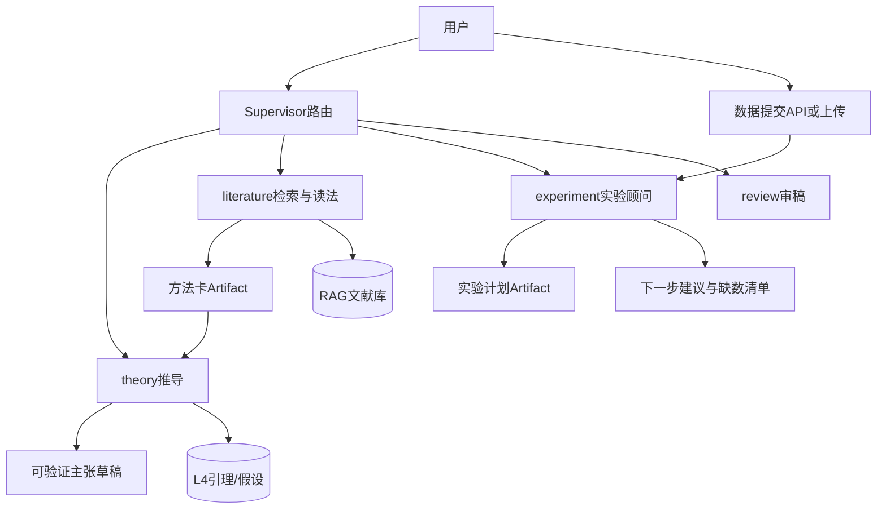

# 产品愿景：AI4S 理论侧多智能体

**领域**：用深度学习解决科学问题的 **理论侧** 协作（AI for Science）。  
**定位**：多智能体系统——检索并阅读文献 → 理论推导/形式化 → 设计实验或下一步科研方向；解读用户提交的数据并规划缺数与下一步。  
**示范子集**：深度学习优化 / 损失函数局部极小 / PL 等为能力子集与课题种子，**不是**唯一领域。  
**边界**：不在系统内复现全流程科研、不部署/代训模型、不以大规模数值实跑为核心卖点。

Campaign S0–S8 已从产品代码移除；主路径为场景化短协作（`RESEARCH_PIPELINE_MODE=auto`）与单 Agent。

---

## 能力闭环

```
literature → MethodCard → theory →（可选 review / counterexample）
  → experiment（ExperimentPlan / NextStepMemo）
  ← 用户交回 DataPacket ←
```

---

## 本期已落地（文案 + Agent 职责）

| Agent | 职责 |
|-------|------|
| general | 理论侧总览；建议实验但不代跑 |
| theory | 推导主路径；文献方法→形式化；SymPy 可选 |
| literature | 检索 + 方法卡式提炼 |
| experiment | **实验顾问**：计划、读数、下一步/缺数 |
| review | 审稿清单；可建议补文献/补实验 |
| counterexample | 反例思路；数值工具非必须 |

## 已实现（架构分支 feat/theory-side-architecture）

- Artifact 模型与 Store：`MethodCard` / `DerivationTrace` / `ExperimentPlan` / `DataPacket` / `NextStepMemo`
- API：`GET/POST /v1/artifacts`
- 场景工作流（`RESEARCH_PIPELINE_MODE=auto`）：`lit_to_theory` / `experiment_plan` / `data_to_nextstep`
- Jupyter 回传旁路写入 `DataPacket`

---

## 下期蓝图：角色 + 工件 + 工具

能力映射到 **角色 + 工件（Artifact）+ 工具**，而不是一条 S0–S8 全自动复现流水线。



### 核心工件

1. **MethodCard（方法卡）** — 问题设定、关键量/损失或目标形式、假设、证明或算法步骤、可复述公式骨架、与课题符号对照  
2. **DerivationTrace（推导迹）** — 分步证明 + 引用的 MethodCard/L4 id + 「待验证」标记  
3. **ExperimentPlan（实验计划）** — 假设→可观测量、对照、超参网格、成功/失败判据、记录字段  
4. **DataPacket（数据包）** — 用户提交的 metrics/曲线摘要/日志路径；**不**要求系统训练模型  
5. **NextStepMemo** — 基于 DataPacket×理论主张：支持/反驳/不确定、缺数清单、下一实验建议

### 场景协作

| 场景 | 流程 |
|------|------|
| 读文献推公式 | literature → MethodCard → theory 对照 symbols/assumptions 形式化 → 可选 review |
| 只要实验怎么做 | experiment → ExperimentPlan（绑定定理/猜想 id） |
| 交了实验数据 | DataPacket → experiment → NextStepMemo；必要时 theory 修订假设 |
| 一般问答 | general；复杂时 Supervisor **单跳或两跳**，不做八阶段 Campaign |

### 工具分层

- **检索**：`arxiv__*` / `web_search__*`；入库保持 upload/from-arxiv；**自动入库低优先级**  
- **理论**：SymPy 保留为符号检查；numerical/Torch 降为可选/隐藏  
- **数据**：统一用户提交路径（`/v1/jupyter/upload-result` JSON，或 `/v1/jupyter/upload-file` 支持 `.xlsx/.csv/.tsv/.json`）→ DataPacket；Agent 只读与解读  
  - Excel/CSV 约定：两列键值（可带 `metric,value` 表头）→ 全部进 metrics；多列表格 → 末行数值列进 metrics  
- **禁止**：触发云端训模型、代部署推理服务
