# AI4S 理论侧多智能体 — 系统架构图

面向「用深度学习解决科学问题」的理论侧协作：文献方法提炼、推导、实验建议与数据解读。  
损失函数局部极小等为示范课题种子，非唯一领域。
**不**以全流程科研复现或代跑训练为核心。产品边界见 [`PRODUCT-VISION.md`](PRODUCT-VISION.md)。

本文档按**功能模块**描述系统架构，不涉及具体代码实现。  
适用于理解整体能力边界、模块职责与数据流向。

---

## 〇、产品能力（用户视角）

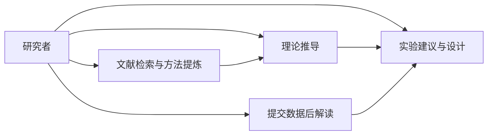

| 能力 | 说明 |
|------|------|
| 理论推导 | 符号/假设工作区、分步证明、审稿清单 |
| 文献 | arXiv / 网页检索；方法提炼；RAG 入库（自动入库增强为后续） |
| 实验顾问 | 计划表、对照、成功判据；根据用户数据给下一步与缺数清单 |
| 边界 | 不代训模型、不以系统内大规模数值实跑为主路径 |

可选模块（验证账本、Torch/numerical）见架构下层「兼容能力」，非主界面叙事。Campaign S0–S8 已从代码移除。

---

## 一、系统总览（技术视角）

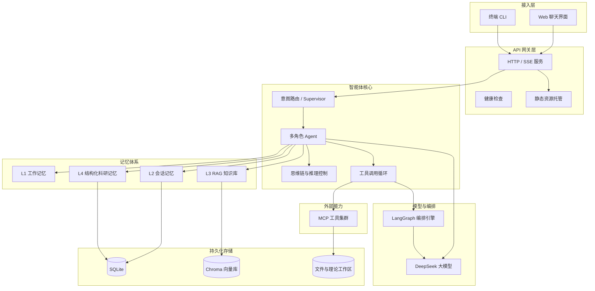

---

## 二、分层架构（按职责）

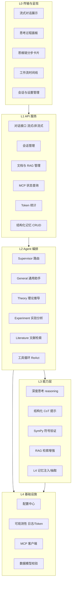

---

## 三、多 Agent 编排

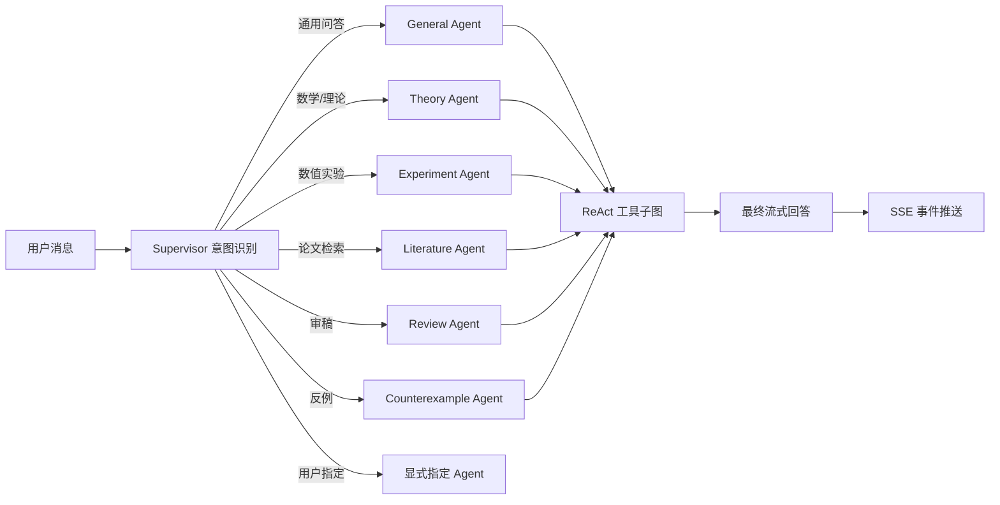

| Agent | 核心职能 |
|-------|----------|
| **Supervisor** | 分析用户意图，选择目标 Agent，发出 handoff 事件 |
| **General** | 通用科研问答、跨领域讨论 |
| **Theory** | 损失函数理论推导、CoT、SymPy/数值验证、引理持久化 |
| **Experiment** | 数值实验、谱分析、loss landscape |
| **Literature** | arXiv/网络检索、文献入库与引用 |
| **Review** | 对照审稿清单检查推导完整性 |
| **Counterexample** | 反例搜索与验证 |

---

## 四、记忆体系（L1–L4）

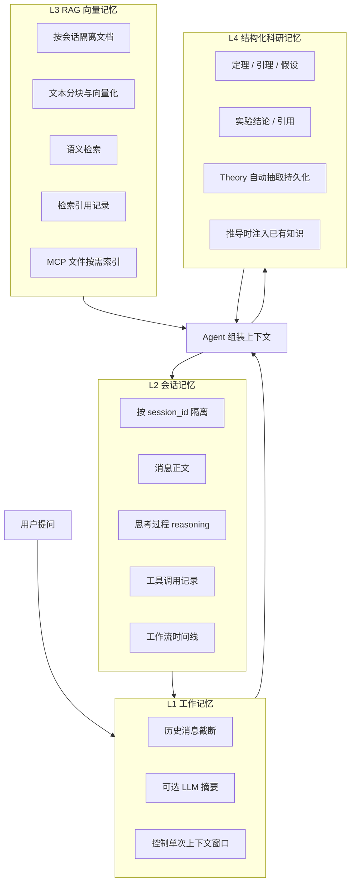

| 层级 | 名称 | 功能说明 |
|------|------|----------|
| **L1** | 工作记忆 | 控制单次请求带入 LLM 的历史条数，可对截断部分做摘要 |
| **L2** | 会话记忆 | 多轮对话持久化：正文、思考过程、工具调用、工作流节点 |
| **L3** | RAG 向量记忆 | 会话级文档上传与语义检索，增强回答上下文 |
| **L4** | 结构化科研记忆 | 定理/引理/假设等结构化知识，供 Theory Agent 注入与回写 |

---

## 五、MCP 工具集群

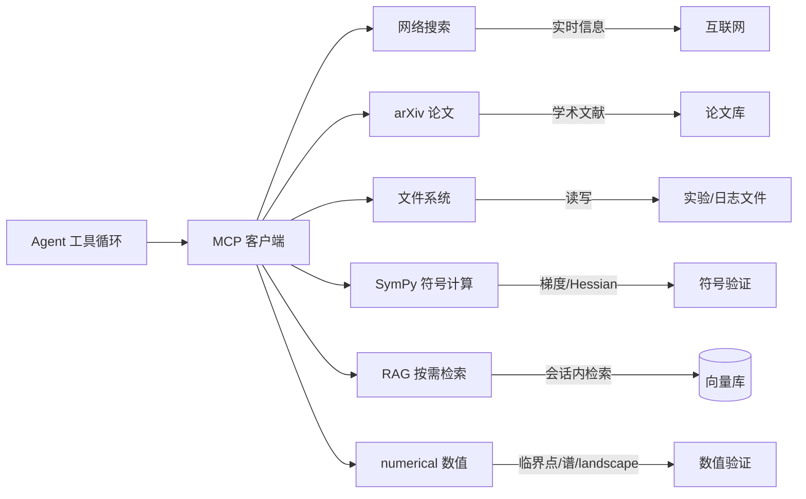

| 工具域 | 功能 |
|--------|------|
| **网络搜索** | 获取最新资料、术语解释、实时信息 |
| **arXiv** | 检索与整理论文元数据 |
| **文件系统** | 读取/写入允许的目录内实验日志与数据 |
| **SymPy** | 微分、Hessian、特征值等符号验证 |
| **RAG** | 从当前会话知识库检索相关片段 |
| **numerical** | 梯度、Hessian 谱、临界点分类、loss landscape、SGD 轨迹 |

---

## 六、思维链与工作流（内置 CoT）

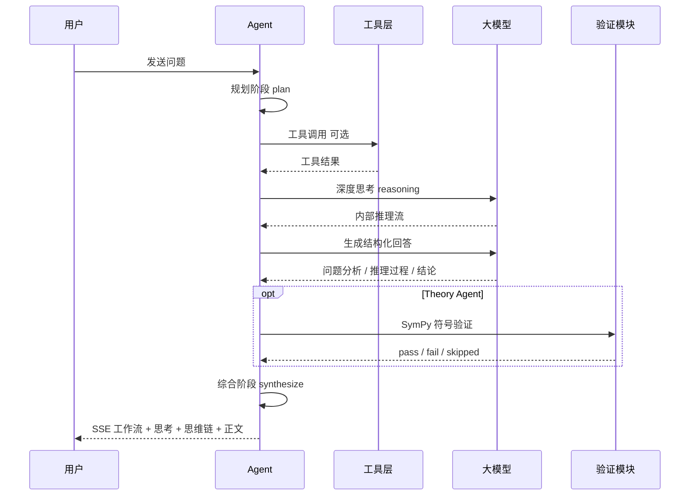

| 能力层 | 作用 | 用户可见形式 |
|--------|------|--------------|
| **深度思考** | 模型内部推理，可开关、可调强度（high/max） | 思考过程折叠面板 |
| **结构化 CoT** | 强制分步输出（关闭 / 标准 / 严格） | 思维链分步卡片 |
| **工作流时间线** | 记录规划 → 工具 → 验证 → 综合 | 工作流节点列表 |
| **Theory 验证** | 推导后自动符号检验 | 验证状态徽章（pass/fail/skipped） |

**编排策略说明：**

- 工具调用阶段关闭 thinking，以节省 token、提升速度
- 最终回答阶段启用 thinking，流式推送 `reasoning` 事件
- Math 模式默认使用严格思维链；Theory Agent 使用专用五阶段推导，不叠加通用三节结构

---

## 七、一次完整对话的数据流

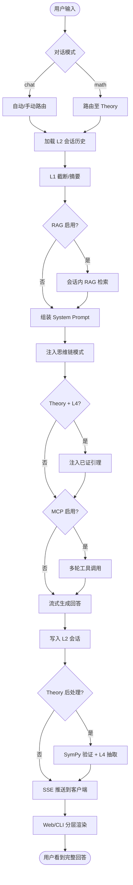

---

## 八、Web 前端功能模块

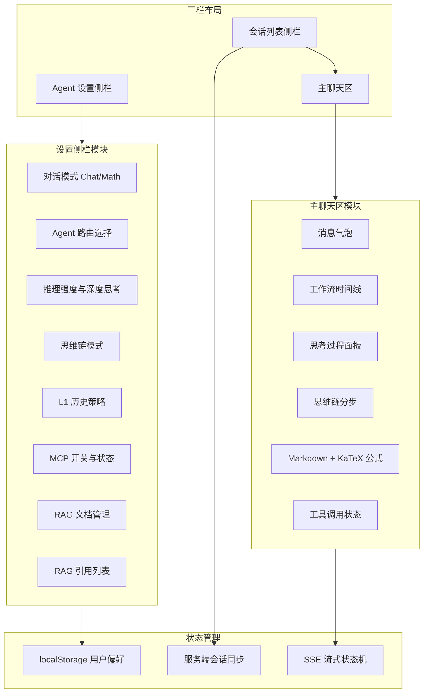

**消息展示顺序（助手消息）：**

1. 工作流时间线（规划 / 工具 / 验证 / 综合）
2. 思考过程面板（模型内部 reasoning）
3. 思维链分步卡片（外显结构化小节）
4. 正文（Markdown + 公式）

---

## 九、部署与运行形态

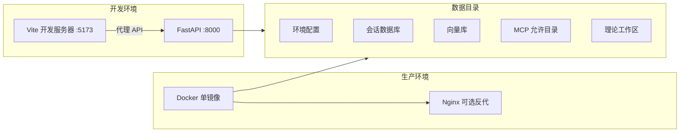

| 环境 | 说明 |
|------|------|
| **开发** | 前端 Vite 热更新，API 代理至后端 8000 端口 |
| **生产** | Docker 单镜像打包前后端；可选 Nginx 反代，SSE 需关闭缓冲 |
| **数据** | 会话 SQLite、Chroma 向量库、MCP 文件目录、理论工作区均挂载于 `data/` |

---

## 十、Theory 推导闭环

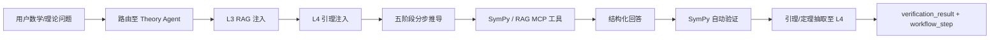

**五阶段推导结构：**

1. 问题形式化
2. 局部分析
3. 结论（引理 / 定理 / 推论）
4. 符号验证（SymPy）
5. 边界条件与反例

---

## 十一、SSE 事件流（客户端视角）

```mermaid
flowchart LR
  Meta[meta 会话与 Agent] --> Plan[workflow_step plan]
  Plan --> Tools[tool_call_start/result/error]
  Tools --> Reason[reasoning 思考片段]
  Reason --> CoTStep[cot_step 思维链小节]
  CoTStep --> Content[content 正文片段]
  Content --> Verify[verification_result Theory]
  Verify --> Handoff[agent_handoff 可选]
  Handoff --> Done[done 结束与 Token 统计]
```

| 事件类型 | 含义 |
|----------|------|
| `meta` | 会话 ID、当前 Agent、路由原因 |
| `workflow_step` | 工作流节点（规划 / 验证 / 综合等） |
| `pipeline_stage` | 遗留兼容名（主路径用 `workflow_step`） |
| `campaign_update` | 已废弃（Campaign 移除；schema 或仍保留字面量） |
| `artifact_saved` | 产物落盘通知 |
| `tool_call_*` | MCP 工具调用开始、成功、失败 |
| `reasoning` | 模型内部思考过程片段 |
| `cot_step` | 结构化思维链小节（JSON） |
| `content` | 最终回答正文片段 |
| `verification_result` | Theory SymPy 验证结果 |
| `numerical_verification_result` | 数值验证结果 |
| `memory_warning` | L4 矛盾检测告警 |
| `agent_handoff` | 多 Agent 切换通知 |
| `done` | 流结束，含 token 用量 |

---

## 十二、模块职责速查表

| 功能域 | 核心职责 |
|--------|----------|
| **接入层** | 为用户提供对话入口（浏览器 / 终端） |
| **API 层** | 请求校验、路由分发、SSE 流式推送 |
| **Supervisor** | 意图识别与 Agent 委派 |
| **六大 Agent** | general / theory / experiment / literature / review / counterexample |
| **场景工作流 / Artifact** | lit→theory / 实验计划 / 数据→下一步；MethodCard 等工件 |
| **课题 / 验证账本** | Project 实体、任务看板、Claim 三层验证（验证非主卖点） |
| **思维链模块** | 深度思考、结构化分步、工作流可视化 |
| **工具循环** | 多轮调用 MCP，汇总结果后生成回答 |
| **LLM 层** | 对接 DeepSeek，分离 reasoning 与 content |
| **L1 工作记忆** | 控制单次请求的上下文长度 |
| **L2 会话记忆** | 多轮对话持久化与恢复 |
| **L3 RAG** | 会话级文档上传、检索、增强回答 |
| **L4 结构化记忆** | 定理/引理等科研知识的存储与复用 |
| **MCP 层** | 统一接入搜索、文献、文件、符号计算等外部能力 |
| **可观测性** | 结构化日志、Token 用量统计 |
| **配置层** | 环境变量、MCP 服务定义、工具白名单 |
| **前端** | 流式渲染、公式、设置、会话与文档管理 |

---

## 相关文档

- [ARCHITECTURE.md](ARCHITECTURE.md) — 实现层架构与目录说明
- [API.md](API.md) — HTTP / SSE 接口参考
- [README.md](README.md) — 项目总览与快速开始
