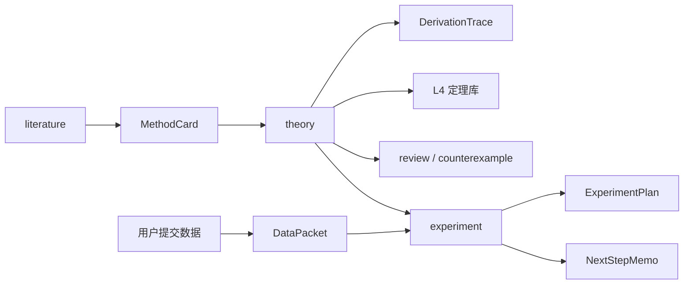

# AI4S 理论侧多智能体系统 — 智能体详细设计文档

| 项 | 内容 |
|----|------|
| 文档版本 | v1.0（提交稿） |
| 产品版本 | AI4S Research Agent v2.2 |
| 日期 | 2026-07-22 |
| 文档类型 | 智能体详细设计（架构 / 角色 / 记忆 / 工件 / 接口 / 运行流程） |
| 对应交付 | 提交材料第 1 项 |

---

## 1. 概述

### 1.1 建设目标

构建面向 **AI for Science（用深度学习解决科学问题）** 的 **理论侧多智能体系统**：协助研究者完成

1. 文献检索与方法提炼；  
2. 理论推导与形式化；  
3. 实验方案设计与用户实验数据解读；  

形成可落盘、可复查的结构化科研工件，而非替代完整实验训练流水线。

### 1.2 一句话定位

**多智能体协作的理论侧科研助手**：`文献 → 方法卡 → 理论推导 →（可选审稿/反例）→ 实验顾问（计划 / 读数 / 下一步）`。

### 1.3 能力边界

| 做 | 不做 |
|----|------|
| 检索与阅读文献、方法结构化 | 系统内代训 / 部署模型 |
| 符号对齐、分步推导、定理库管理 | 以大规模数值实跑为核心卖点 |
| 实验计划、缺数诊断、数据解读 | 完整科研 Campaign 八阶段自动复现 |
| 用户提交 metrics / 表格后的对照分析 | 编造文献或实验结果 |

示范课题种子（如损失函数局部极小、PL 条件）用于验证能力闭环，**不限制**系统仅服务该领域。

### 1.4 术语

| 术语 | 含义 |
|------|------|
| Agent | 具有独立系统提示词与工具白名单的角色智能体 |
| Artifact | 结构化科研工件（方法卡、推导迹、实验计划等） |
| L1–L4 | 工作记忆 / 会话记忆 / RAG / 结构化科研记忆 |
| MCP | Model Context Protocol，外部工具协议 |
| 场景工作流 | 在 `RESEARCH_PIPELINE_MODE=auto` 下触发的 2–3 跳协作 |

---

## 2. 总体架构

### 2.1 逻辑分层

```
┌─────────────────────────────────────────────────────────┐
│ 接入层：Web UI / HTTP API / SSE                          │
├─────────────────────────────────────────────────────────┤
│ 编排层：意图路由 Supervisor + 场景工作流 SceneExecutor     │
├─────────────────────────────────────────────────────────┤
│ 智能体层：general / theory / literature / experiment /    │
│           review / counterexample                         │
├─────────────────────────────────────────────────────────┤
│ 模型与工具：DeepSeek LLM + LangGraph + MCP 工具集群        │
├─────────────────────────────────────────────────────────┤
│ 记忆层：L1 工作记忆 · L2 会话 · L3 RAG · L4 定理库         │
├─────────────────────────────────────────────────────────┤
│ 持久化：SQLite · Chroma · 课题文件工作区 · Artifact JSON   │
└─────────────────────────────────────────────────────────┘
```

### 2.2 技术栈

| 层级 | 技术选型 |
|------|----------|
| API | FastAPI + Uvicorn |
| 前端 | React 18 + TypeScript + Vite |
| LLM | DeepSeek（Chat Completions，支持 thinking / 流式） |
| 编排 | LangGraph（可配置）+ 多 Agent Orchestrator |
| 会话 / L4 | SQLite |
| 向量检索 | Chroma |
| 工具 | MCP（arxiv / web_search / sympy / filesystem / rag / numerical） |
| 部署形态 | 单进程托管 API + `web/dist` 静态资源（Docker 可选，本提交不含镜像包） |

### 2.3 能力闭环（主叙事）



---

## 3. 智能体角色详细设计

### 3.1 角色总表

| Agent | 中文名 | 主职责 | 典型输出 |
|-------|--------|--------|----------|
| general | 总览助手 | 澄清问题、推荐角色、一般问答 | 引导性回答 |
| literature | 文献助手 | 检索、读法、方法提炼 | MethodCard、文献列表 |
| theory | 理论助手 | 形式化、分步证明、写入定理库 | 引理/定理 Markdown、DerivationTrace |
| experiment | 实验顾问 | 实验计划、读数、下一步 | ExperimentPlan、NextStepMemo |
| review | 审稿助手 | 对照清单审推导 | 审稿意见 |
| counterexample | 反例助手 | 构造反例思路 | 反例草案 |

系统提示词集中于 `app/server/llm/prompts.py`，由 `app/server/agents/config.py` 注册。

### 3.2 theory（理论主路径）

**输入**：用户问题；可选 RAG 片段；可选 L4 已有引理；理论工作区 `symbols.md` / `assumptions.md`。

**处理步骤（提示词约束）**：

1. 问题形式化（目标量、假设、符号）  
2. 核心分析（一阶/二阶或其他）  
3. 文献方法到公式（若有）  
4. 结论以「引理 / 定理」分节  
5. 可选 SymPy 核对  

**输出**：Markdown 证明 + 可选 `artifact:DerivationTrace`；含 `## 引理/定理` 时自动抽取写入 L4。

**工具白名单（典型）**：sympy、rag、filesystem（只读配置类）。

### 3.3 literature（文献）

**输入**：检索意图、论文线索、已上传 PDF（RAG）。

**处理**：arXiv / 网页检索 → 方法卡结构提炼。

**输出**：方法说明 + `artifact:MethodCard`（问题设定、损失/目标形式、假设、步骤、公式骨架、符号对照）。

### 3.4 experiment（实验顾问）

**输入**：理论主张、用户问题、可选 DataPacket。

**处理**：

- 无数据：产出实验计划（目标、变量、对照、判据、记录字段）  
- 有数据：判读 supported / refuted / inconclusive，列缺数与下一步  

**输出**：`ExperimentPlan`、`NextStepMemo`；**禁止**代跑大规模训练。

### 3.5 review / counterexample

- **review**：对照审稿清单检查符号一致性、假设完整性、证明缺口。  
- **counterexample**：针对猜想构造最小复杂度反例思路；数值工具非必须。

### 3.6 general

理论侧总览与分流入口；`auto_route=false` 时作为默认落点。

---

## 4. 编排与路由设计

### 4.1 单跳意图路由（Supervisor）

请求字段：`agent`、`auto_route`（默认 true）。

优先级：

1. **显式指定 agent** → 直接执行该角色；  
2. **auto_route=true** → LLM 轻量分类或规则分类 → `general|theory|literature|experiment`；  
3. **auto_route=false** → 固定 general。

### 4.2 场景工作流（短协作，2–3 跳）

配置项：`RESEARCH_PIPELINE_MODE=auto|single`。

| 场景 ID | 触发条件 | 协作链 |
|---------|----------|--------|
| lit_to_theory | `/method` 或 literature + 方法/公式类意图 | literature → MethodCard → theory → DerivationTrace（可选 review） |
| experiment_plan | experiment 且无数据解读意图 | experiment → ExperimentPlan |
| data_to_nextstep | experiment 且有 DataPacket 或读数意图 | experiment → NextStepMemo（可修订计划） |

场景命中时优先于单跳路由；流式事件含 `pipeline_stage`、`artifact_saved`。

### 4.3 对话主路径（SSE）

```
客户端 POST /v1/chat/stream
  → Orchestrator 解析目标 / 场景
  → SubAgent：组装 system（RAG/L4/工作区）+ 历史(L1) + 用户消息
  → DeepSeek 流式：reasoning / content / tool_calls
  → 工具循环（MCP）
  → 后处理：Artifact 抽取、L4 定理抽取、会话落库
  → SSE 推送至前端
```

---

## 5. 记忆体系设计

### 5.1 四层记忆

| 层级 | 名称 | 存储 | 作用 |
|------|------|------|------|
| L1 | 工作记忆 | 请求时计算 | 截断历史、可选摘要，控制进模窗口 |
| L2 | 会话记忆 | SQLite | 完整多轮对话、工具记录、工作流节点 |
| L3 | RAG 向量记忆 | Chroma | PDF/文本切块语义检索，增强文献上下文 |
| L4 | 结构化科研记忆 | SQLite | 定理/引理/假设条目 + 依赖边（关系图谱） |

### 5.2 L4 与前端定理库

- 来源：Theory 自动抽取、用户手工 CRUD、Markdown/PDF 导入（候选确认）。  
- 注入：默认对 `theory,experiment,review` 注入当前会话条目。  
- 图谱：节点即 L4 条目；边由正文 `**依据**` 解析或 API 创建。

### 5.3 课题（Project）

课题绑定会话、任务看板、共享工作区文件与 Artifact 目录；默认课题 `default`。

---

## 6. 科研工件（Artifact）设计

### 6.1 类型与字段（摘要）

| 类型 | 用途 | 关键字段 |
|------|------|----------|
| MethodCard | 文献方法中间表示 | problem_setup, loss_form, key_assumptions, proof_or_algo_steps, formula_skeleton_latex, symbol_map |
| DerivationTrace | 分步推导迹 | steps[{title,body,status}], method_card_ids, l4_ref_ids, claim_yaml |
| ExperimentPlan | 实验计划（追加式） | objectives, variables, controls, success_criteria, record_fields, status |
| DataPacket | 用户实验数据 | metrics, summary, source |
| NextStepMemo | 读数后建议 | verdict, missing_data, next_experiments |

### 6.2 落盘机制

Agent 在回答中输出围栏：

````markdown
```artifact:MethodCard
{ ... JSON ... }
```
````

服务端解析、字段归一化（兼容 LLM 把列表写成字符串等偏差）、校验后写入：

`data/projects/{project_id}/artifacts/{Type}/{uuid}.json`

### 6.3 与用户操作的关系

- 定理库、实验计划、读数建议支持前端 CRUD；  
- MethodCard / DerivationTrace 以 Agent 产出 + 面板展示为主；  
- Jupyter / 文件上传可旁路写入 DataPacket。

---

## 7. 工具系统设计（MCP）

| Server | 能力 | 主要服务 Agent |
|--------|------|----------------|
| arxiv | 论文检索与元数据 | literature |
| web_search | 网页检索 | literature / general |
| sympy | 符号微分、Hessian、凸性检查等 | theory / counterexample |
| filesystem | 受限目录读写 | experiment / review |
| rag | 按会话检索语料 | theory / experiment |
| numerical | 小规模数值核对（非默认主路径） | 可选 |

白名单：`conf/mcp_tool_whitelist.json`；运行时：`GET /v1/mcp/status`。

---

## 8. 接口设计（调用侧摘要）

> 完整清单见仓库 `doc/API-COVERAGE.md`（约 71 端点）。提交第 2 项「远程调用说明」可在后续镜像交付中展开；此处给出智能体运行必需接口。

### 8.1 对话

| 方法 | 路径 | 说明 |
|------|------|------|
| POST | `/v1/chat/stream` | SSE 流式对话（主路径） |
| POST | `/v1/chat` | 非流式 |
| GET | `/v1/sessions` | 会话列表 |
| GET | `/health` | 健康检查 |

**ChatRequest 关键字段**：`message`, `session_id`, `agent`, `auto_route`, `mode`, `project_id`, `enable_tools`, `cot_mode`, `enable_thinking`。

### 8.2 文献 / 记忆 / 工件

| 域 | 代表接口 |
|----|----------|
| RAG | `POST /v1/documents/upload`, `GET /v1/documents` |
| L4 | `GET/POST/PATCH/DELETE /v1/memory/structured`, `GET .../graph` |
| Artifact | `GET/POST/PATCH/DELETE /v1/artifacts` |
| 数据回传 | `POST /v1/jupyter/upload-result`, `upload-file` |

### 8.3 调用示例（非流式）

```bash
curl -s http://127.0.0.1:8000/v1/chat \
  -H 'Content-Type: application/json' \
  -d '{
    "message": "请对二次损失 L=½‖Xθ−y‖² 做简短形式化并输出 DerivationTrace",
    "session_id": "demo-submit",
    "agent": "theory",
    "auto_route": false,
    "project_id": "default",
    "enable_tools": false
  }'
```

---

## 9. 前端与人机交互设计

### 9.1 主界面

- 左：会话 / 课题 / 任务看板  
- 中：多轮对话（含推理过程、工具调用、流水线阶段）  
- 右：科研工作台 Tabs  

### 9.2 工作台 Tabs

| Tab | 内容 |
|-----|------|
| 文献 | 文档上传、RAG 引用、方法卡 |
| 理论 | 推导迹、定理库、假设 DAG、关系图谱、工作区文件 |
| 验证 | 验证看板、可观测性 |
| 产出 | 实验计划 / 读数建议、实验记录、导出 |

### 9.3 关键交互原则

- Artifact / L4 变更后可刷新面板复查；  
- 导入 PDF 到定理库采用「候选确认」防脏写；  
- 实验顾问强调用户本机出数，系统解读。

---

## 10. 运行与安全约束

1. **密钥**：`DEEPSEEK_API_KEY` 等置于 `conf/.env`，不入库明文提交。  
2. **文件系统**：MCP filesystem 限制在 `MCP_ALLOWED_DIRS`。  
3. **RAG 隔离**：按 session / project 检索，避免串会话；课题共享语料需注意主题污染。  
4. **场景健壮性**：Literature 未产出有效 MethodCard 时，不宜把澄清话术误当作「文献方法」喂给 Theory（已知改进点）。  
5. **SSE**：反向代理须关闭 buffering，超时建议 ≥ 600s。

---

## 11. 典型运行全过程（与演示视频对应）

| 步骤 | 用户操作 | 系统行为 |
|------|----------|----------|
| 1 | 打开 Web，选择/新建会话与默认课题 | 加载工作台 |
| 2 | 上传 PDF 或检索文献 | L3 入库 / literature 检索 |
| 3 | `/method` 或 literature 提炼方法 | MethodCard 落盘 |
| 4 | theory 形式化推导 | DerivationTrace + L4 定理 |
| 5 | experiment 要实验计划 | ExperimentPlan |
| 6 | 上传实验指标 | DataPacket → NextStepMemo |
| 7 | 复查定理库 / 计划 / 图谱 | 人机共改 |

详细分镜见同目录 `demo/演示脚本.md` 与演示视频。

---

## 12. 验收对照（智能体能力）

| 验收点 | 设计对应 |
|--------|----------|
| 多角色智能体 | 六 Agent + 独立提示词与工具白名单 |
| 可观测协作 | SSE 阶段事件、Artifact 落盘、工作台面板 |
| 记忆与知识 | L1–L4 + 课题工作区 |
| 闭环 | 文献→理论→实验计划→数据→下一步 |
| 边界清晰 | 不代训、不部署、不大规模实跑 |

---

## 13. 附录：关键源码索引

| 内容 | 路径 |
|------|------|
| 产品愿景 | `doc/PRODUCT-VISION.md` |
| 系统架构 | `doc/SYSTEM_ARCHITECTURE.md` / `doc/ARCHITECTURE.md` |
| Agent 提示词 | `app/server/llm/prompts.py` |
| 场景路由 | `app/server/graph/scenes/workflow.py` |
| 编排器 | `app/server/agents/orchestrator.py` |
| Artifact 模型 | `app/shared/artifact_models.py` |
| MCP 配置 | `conf/mcp_servers.json` |
| API 覆盖 | `doc/API-COVERAGE.md` |

---

## 修订记录

| 版本 | 日期 | 说明 |
|------|------|------|
| v1.0 | 2026-07-22 | 提交稿：智能体详细设计 |
